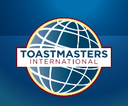

.. toctree::
   :maxdepth: 2

Resources for Toastmasters Grammarians
**************************************

What is Toastmasters
++++++++++++++++++++

Toastmasters is an international non-profit founded in 1924 in Santa Ana, CA by Dr. Ralph Smedley. Originally designed to empower socially anxious employees in an era before leadership training became commonplace, the club has grown since then to an international presence. As of 2024, the club boasts over 300,000 members across 14,000 clubs in 149 countries. 

The typical Toastmasters club meets weekly or biweekly for two hours. Members choose a set of personal goals aligning with one of six core professional development tracts:

- Dynamic Leadership
- Engaging Humor
- Motivational Strategies
- Persuasive Influence
- Presentation Mastery

Each tract has five levels, expected to take between 3-6 months each to complete, within it. The core progression of a Toastmaster is to complete a series of guided speeches that teach key elements of presentation and oratory such as effective use of audience engagement, body language, and the types and purposes of different speech styles. 

Toastmaster Leadership Roles
++++++++++++++++++++++++++++

Each Toastmaster club has six key officer roles for those aspiring to learn team management and leadership skills via service. 

However, for those in the intermediate stages wanting to dip their toes into leadership on a smaller scale? There are also several individual meeting roles that members can sign up for at each meeting. These roles include:

+-------------------------------+-------------------------------------------------------------------------------------------------------------------------------------------------+
| Meeting Role                  | Brief Description of the Meeting Role Duties                                                                                                    |
+===============================+=================================================================================================================================================+
| Toastmaster of the Day        | Runs the overall meeting                                                                                                                        |
+-------------------------------+-------------------------------------------------------------------------------------------------------------------------------------------------+
| Table Topics Master           | Comes up with Table Topics and runs the impromptu speeches                                                                                      |
+-------------------------------+-------------------------------------------------------------------------------------------------------------------------------------------------+
| Timer                         | Keeps the overall meeting on time and provides time cues for speakers                                                                           |
+-------------------------------+-------------------------------------------------------------------------------------------------------------------------------------------------+
| Evaluator                     | Evaluate one or more individual speakers and provide personalized feedback on their speeches                                                    |
+-------------------------------+-------------------------------------------------------------------------------------------------------------------------------------------------+
| Jokemaster                    | Opens the meeting with a light-hearted joke (usually from some other source)                                                                    |
+-------------------------------+-------------------------------------------------------------------------------------------------------------------------------------------------+
| Grammarian                    | Helps club members improve their vocabulary by selecting a Word of the Day and noting excellent turns-of-phrase and wordings during the meeting |
+-------------------------------+-------------------------------------------------------------------------------------------------------------------------------------------------+
| Ah-Counter                    | Records the usage of filler words during a meeting.                                                                                             |
+-------------------------------+-------------------------------------------------------------------------------------------------------------------------------------------------+

One of the more beginner-friendly possible roles is that of the Grammarian. As noted, the Grammarian's primary role is to select a word of the day, keep track of its usage by members, and note any particularly interesting rhetorical turns of phrase among those members speaking during the evening. In many clubs, this role is also combined with the role of Ah-Counter, and so the most important first step after selecting a date to act as Grammarian is to determine whether the duties of the Ah-Counter are also included within the Grammarian's role! 

Things to Do Before the Meeting
+++++++++++++++++++++++++++++++

1. Keep in Touch! 

The Grammarian speaks for less than ten minutes total given a typical one-to-two hour meeting! *The majority of the work is actually completed before the meeting starts.* The most important duty, of course, is to confirm the date of service. Each club will handle this differently, but most clubs will have some form of online sign-up. After signing up, it is good to also send a brief email to the Toastmaster for the evening who will be leading the overall meeting. Confirm they recognize your name and know the role you will be serving. It is also a good idea to ask if there is any particular theme for the meeting. This can help with selecting the Word of the Day (see below.)

2. Select the Word of the Day

The Grammarian has full control over what the word of the day will be. However, there are some best practices recommended when selecting a word. 

 1. Try to match the word of the day to the overall meeting theme. This will make it easier for shy members - and those who struggle to think on their feet - to use the word extemporaneously! 

 2. Make sure to listen to the pronunciation of the word online. You will need to be the first to say it at the meeting. 

 3. Select a word of no more than two to three syllables. These are easier to remember and to speak aloud, especially for those who may stammer or use many filler words. 

 4. Select a word at around a 9th or 10th grade reading level. Some of the best speeches in history have been written at around this reading level. For instance, Martin Luther King's "I Have a Dream" speech was written at this reading level, and it is widely considered one of the world's foremost examples of gravitas still comprehensible by diverse audiences. 

 5. Make use of one of the many random word generators online such as:
 
	 - `Random word generator`_.
	 - `Word counter`_.
	 - You can also browse Pinterest_. Search terms such as "beautiful words" or "word of the day" will provide many inspirational words to pin.

.. _`Random word generator`: https://randomwordgenerator.com/
.. _`Word counter`: https://wordcounter.net/random-word-generator
.. _Pinterest: https://pinterest.com/

 6. Download helpful templates from Toastmasters online. The organization itself has pre-built templates for tracking both uses of the Word of the Day and Ah-Counting (if that is part of the Grammarians role for the day. 

On the Day of the Meeting
+++++++++++++++++++++++++

**First off all, relax!** Doing the prep work above really is the majority of the work for the Grammarian. On the day of the meeting, be prepared to be introduced roughly third or fourth in the meeting order (typically after the Toastmaster for the evening introduces the Jokemaster and the Timer for the evening.)

You can follow the suggested script, or you can offer a little personal flare. What led that Word of the Day to speak to you? Does it fit the theme? Introduce it. Use it in a sentence. If it is an online meeting, also drop the word and the definition in the chat. 

From then on, tracking is made simple by using the pre-made templates above. Count each use of the Word of the Day, record it on the tracker, and note the speaker's name. If also acting as Ah-Counter, use the separate tracker to count each filler word such as "ah," "um," or "like." 

*Tip: you only need to count during formal parts of the evening.* This typically includes the scheduled speakers, table topics speakers, and their evaluators. Keep both a running total of usages of filler words, but also count by each speaker.

If any particular words or phrases stand out during the prepared speeches, note these down as well on the appropriate places in the template. 

When called upon at the end of the meeting by the Toastmaster, report your findings. At minimum, report the total number of uses of the Word of the Day across all speakers and the total number of filler words across all speakers. Many clubs will also report by individual speaker totals, to help members improve. It is appropriate and kind to ask each prepared speech speaker for the evening if they would like their individual totals for feedback provided. Follow their lead!

Once this report is given, the duties end for most clubs. Some clubs, however, will ask leaders to email their templates to the club's minute taker for tracking over time. Ask your own club if you have questions!
