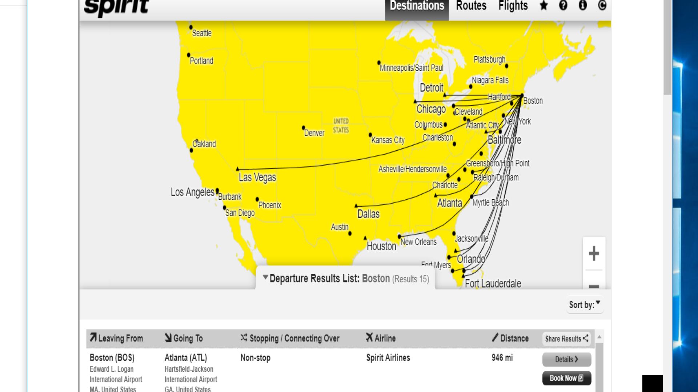

Roffo HW 7: Use THIS file. I wish we could see the Rendering. I can see some of it, italics and bold; 
Save this text file as .rst.

This is the sphinx site that we can look up how to write the code for .rst:
https://www.sphinx-doc.org/en/master/usage/restructuredtext/index.html
~~~~~~~~~~~~~~~~~~~~~~~~~~~~~~~
4.3.2025 -- From the website above, I learned about Sphinx and reStructured Text:
Roffo's Minimal HW Requirements, to start us off:

reStructuredText¶   TITLE, so I will "double-underline" it using equal signs. OK. 
=======================
ReStructured Text Title
=======================
Here is a paragraph. ReStructuredText (reST) is the default plaintext markup language used by both Docutils and Sphinx. 
Docutils provides the basic reStructuredText syntax, while Sphinx extends this to support additional functionality.
For now, I'll just use Docutils because time is short and I'm trying to complete all the homeworks. Hopefully, I can come back and try Sphinx.

You must include a blank line between paragraphs. Ok. Here is the second paragraph and a hyperlink target:
According to the hyperlink reference docutils_, .. _Docutils: https://docutils.sourceforge.io/docs/user/rst/quickref.html#hyperlink-targets, 
*One asterisk before and after a string is the emphasis of italics.*
I read on Docutils that paragraphs are left-aligned. Apparently no indents. OK. 

**Two asterisks before and after a string is the emphasis of bold.**
The below guides go through the most important aspects of reStructuredText. For the authoritative reference, refer to the docutils documentation.

========================
More tips from Docutils:
========================
Subtitle: the most used formatting
----------------------------------
Titles are underlined (or over-and underlined) with a printing nonalphanumeric 7-bit ASCII character. 
OH! It doesn't HAVE to be the equal sign! There are many Recommended choices, which are: "``= - ` : ' " ~ ^ _ * + # < >``".
The underline/overline must be at least as long as the title text.

A lone top-level (sub)section is lifted up to be the document's (sub)title.
Ok, let's see if that works for the word "Subtitle" above. Didn't completely work...I'll have to research that. 

* This is a list item
* Here is a second list item
    * This is a sub-bullet
    * This is the second sub-bullet

The quick brown fox jumped over the lazy dog.

This is a title (check)
===============

Here is a paragraph.(check)

Here is another paragraph. You must include a blank line between paragraphs.(check)

* This is a list item
* Here is a second list item
    * This is a sub-bullet
    * This is the second sub-bullet

The quick brown fox jumped over the lazy dog.

~~~~~~~~~~~~~~~~~~~BELOW ARE CONTENTS OF FILE NAMED YourName.rst
Look a Title
============

The above is a title. It could be formatted as something specifically labeled a title, or maybe just a heading level one. 

- I also need a list.
- This is a second list item.
- And look, a third list item.

#. Now I need an ordered list.
#. I can use this for procedures.
#. Or to identify items in an image I don't want to translate.

This is a `link to Google<http://www.google.com>`_.

The above should point to a map of where Spirit flies located in folder RoffoHW, week 7, under the Homework folder; same folder as this HW you are reading. Hmm, did not quite work; I see the word "image" in red font on line 75 of GitHub Desktop file; I'll have to research what little thing is out of order. I checked it with another classmate who used the same format, so I do not know; maybe images don't show on GitHub Desktop. Ok, it's 6:55 so I have to Submit and get to the Class zoom! 

The final item is a Table. Gee, I wish we could use Text Colors in ReST. Text could be so much easier to read if it could be separated by colors. Maybe in the Python/Sphinx option. 

+-------------------------+------------------------+
| Table Head 1            | Table Head Column 2    |
+=========================+========================+
| Column 1                | Column 2               |
+-------------------------+------------------------+
| More Column 1           | More Column 2          |
+-------------------------+------------------------+
| And a third row for fun | With one more column 2 |
+-------------------------+------------------------+

>>>>>>>>>>>>>>>>>>>>>>>>>>>>>>>>>>>>>>>>>>>>>>>>>>>>>>>>>>
	Table of Bobbi's Homework for Tech Tools
>>>>>>>>>>>>>>>>>>>>>>>>>>>>>>>>>>>>>>>>>>>>>>>>>>>>>>>>>>
+----------------------------+---------------------------+
| Bobbi's HW Completed:       |Bobbi's HW Still to Do:    |
+============================+===========================+
| Word                       | DITA                      |
+----------------------------+---------------------------+
| HTML	                     | Video Script              |
+----------------------------+---------------------------+
| Markdown                   | Workflow Diagram          |
+----------------------------+---------------------------+
| ReStructured Text          | Final Project             |
+----------------------------+---------------------------+
I extended the columns and added a row, for practice with this table. 
WEEK 7 ASSIGNMENT COMPLETE!!! #

BELOW are other misc notes I copied from the files provided this week, in case they would be useful for the homework or other. So far I haven't needed them, but good resource info. Sphinx and other stuff. 

~~~~~~~~~~~~~~~~~~~~MCC documentation reST
.. mcc_reST documentation master file, created by
   sphinx-quickstart on Tue Mar  3 21:32:24 2020.
   You can adapt this file completely to your liking, but it should at least
   contain the root `toctree` directive.

Welcome to mcc_reST's documentation!
====================================

.. toctree::
   :maxdepth: 2
   :caption: Contents:

   myFirstreST
   secondreST

Indices and tables
==================

* :ref:`genindex`
* :ref:`modindex`
* :ref:`search`

~~~~~~~~~~~~~~~~~~~~~~~~~~~~Sphinx: document is called Makefile.

# Minimal makefile for Sphinx documentation
#

# You can set these variables from the command line.
SPHINXOPTS    =
SPHINXBUILD   = sphinx-build
SPHINXPROJ    = mcc_reST
SOURCEDIR     = .
BUILDDIR      = _build

# Put it first so that "make" without argument is like "make help".
help:
	@$(SPHINXBUILD) -M help "$(SOURCEDIR)" "$(BUILDDIR)" $(SPHINXOPTS) $(O)

.PHONY: help Makefile

# Catch-all target: route all unknown targets to Sphinx using the new
# "make mode" option.  $(O) is meant as a shortcut for $(SPHINXOPTS).
%: Makefile
	@$(SPHINXBUILD) -M $@ "$(SOURCEDIR)" "$(BUILDDIR)" $(SPHINXOPTS) $(O)

~~~~~~~~~~~~~~~~~~~~~~~~~~~~~~~BELOW are THE CONTENTS OF conf.py folder:4.3.25
# -*- coding: utf-8 -*-
#
# Configuration file for the Sphinx documentation builder.
#
# This file does only contain a selection of the most common options. For a
# full list see the documentation:
# http://www.sphinx-doc.org/en/master/config

# -- Path setup --------------------------------------------------------------

# If extensions (or modules to document with autodoc) are in another directory,
# add these directories to sys.path here. If the directory is relative to the
# documentation root, use os.path.abspath to make it absolute, like shown here.
#
# import os
# import sys
# sys.path.insert(0, os.path.abspath('.'))

# -- Project information -----------------------------------------------------

project = 'mcc_reST'
copyright = '2020, Zoe Lawson'
author = 'Zoe Lawson'

# The short X.Y version
version = ''
# The full version, including alpha/beta/rc tags
release = ''

# -- General configuration ---------------------------------------------------

# If your documentation needs a minimal Sphinx version, state it here.
#
# needs_sphinx = '1.0'

# Add any Sphinx extension module names here, as strings. They can be
# extensions coming with Sphinx (named 'sphinx.ext.*') or your custom
# ones.
extensions = [
]

# Add any paths that contain templates here, relative to this directory.
templates_path = ['_templates']

# The suffix(es) of source filenames.
# You can specify multiple suffix as a list of string:
#
# source_suffix = ['.rst', '.md']
source_suffix = '.rst'

# The master toctree document.
master_doc = 'index'

# The language for content autogenerated by Sphinx. Refer to documentation
# for a list of supported languages.
#
# This is also used if you do content translation via gettext catalogs.
# Usually you set "language" from the command line for these cases.
language = None

# List of patterns, relative to source directory, that match files and
# directories to ignore when looking for source files.
# This pattern also affects html_static_path and html_extra_path .
exclude_patterns = ['_build', 'Thumbs.db', '.DS_Store']

# The name of the Pygments (syntax highlighting) style to use.
pygments_style = 'sphinx'

# -- Options for HTML output -------------------------------------------------

# The theme to use for HTML and HTML Help pages.  See the documentation for
# a list of builtin themes.
#
html_theme = 'alabaster'

# Theme options are theme-specific and customize the look and feel of a theme
# further.  For a list of options available for each theme, see the
# documentation.
#
# html_theme_options = {}

# Add any paths that contain custom static files (such as style sheets) here,
# relative to this directory. They are copied after the builtin static files,
# so a file named "default.css" will overwrite the builtin "default.css".
html_static_path = ['_static']

# Custom sidebar templates, must be a dictionary that maps document names
# to template names.
#
# The default sidebars (for documents that don't match any pattern) are
# defined by theme itself.  Builtin themes are using these templates by
# default: ``['localtoc.html', 'relations.html', 'sourcelink.html',
# 'searchbox.html']``.
#
# html_sidebars = {}

# -- Options for HTMLHelp output ---------------------------------------------

# Output file base name for HTML help builder.
htmlhelp_basename = 'mcc_reSTdoc'

# -- Options for LaTeX output ------------------------------------------------

latex_elements = {
    # The paper size ('letterpaper' or 'a4paper').
    #
    # 'papersize': 'letterpaper',

    # The font size ('10pt', '11pt' or '12pt').
    #
    # 'pointsize': '10pt',

    # Additional stuff for the LaTeX preamble.
    #
    # 'preamble': '',

    # Latex figure (float) alignment
    #
    # 'figure_align': 'htbp',
}

# Grouping the document tree into LaTeX files. List of tuples
# (source start file, target name, title,
#  author, documentclass [howto, manual, or own class]).
latex_documents = [
    (master_doc, 'mcc_reST.tex', 'mcc\\_reST Documentation',
     'Zoe Lawson', 'manual'),
]

# -- Options for manual page output ------------------------------------------

# One entry per manual page. List of tuples
# (source start file, name, description, authors, manual section).
man_pages = [
    (master_doc, 'mcc_rest', 'mcc_reST Documentation',
     [author], 1)
]

# -- Options for Texinfo output ----------------------------------------------

# Grouping the document tree into Texinfo files. List of tuples
# (source start file, target name, title, author,
#  dir menu entry, description, category)
texinfo_documents = [
    (master_doc, 'mcc_reST', 'mcc_reST Documentation',
     author, 'mcc_reST', 'One line description of project.',
     'Miscellaneous'),
]